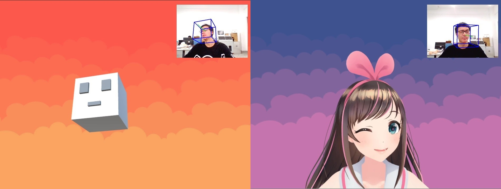
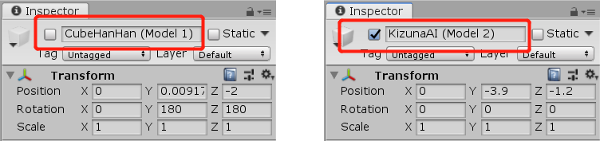
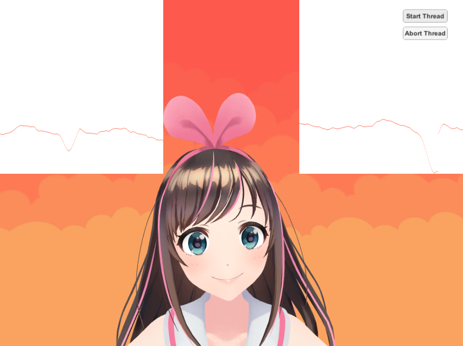

# OpenVHead

**Author:** [Tianxing Wu](https://github.com/TianxingWu)

    

## Introduction

This is an on-going project to build a virtual head system for **VTubers**. To make the animation looks more authentic, several filters and control methods are used to smooth and enhance the robustness of the head motion and facial expressions. The system is mainly build with C# and Python in Unity3D environment.

Let's try it on your own! Please feel free to add new functions to this project or just play around with it for entertainment. 

To cite this repo, please reference the name "OpenVHead" with the project link [here](https://github.com/TianxingWu/OpenVHead).

The detailed documentation for the method is still under construction.

## Prerequisite

### Hardware
- PC
- RGB camera (compatible with both built-in webcam and external usb camera)

### Software
#### Environment
- Windows system
- Python 3.6.x
- Unity 2018.4.x
#### Package dependencies
- opencv-python 3.4.0
- dlib 19.7.0

## Usage
### Quit Start
1. Configure the environment. You may use pip to install the required packages. The .whl file of opencv-python 3.4.0 and dlib 19.7.0 packages can be downloaded from [here](https://pypi.org/project/opencv-python/3.4.0.12/#files) and [here](https://pypi.org/project/dlib/19.7.0/#files). Note that you should choose the appropriate version.

2. Clone or download the repository to your workspace.

3. Open the folder as a project in Unity.

4. Press the Play button to run the project.

5. Press the "Start Thread" button on the UI to start the C# socket server. A cmd window should pop up and the Python client would start to communicate with the sever. Now the python script would be running in the background to extract features from the video stream captured by camera and send them to Unity. The virtual character come to life!

6. Press the Play button again to stop the programme. It's not recommended to press the "Stop Thread" button since it seems to cause bugs from time to time. 

### Model Selection
This system now has 2 character models with customized parameter settings. To change the character model, select the corresbond GameObject in the Scene hierarchy and unhide it by clicking on the toggle next to the object's name in the inspector, while the other GameObject should be hide. For example, if you want to change to model 2, the setting should look like this:

    

### Debug mode
To make it easier to tune the control parameters, a debug mode is offered to visualize the eyes' openning value for the Kizuna AI model. You can enable this mode by unhiding the child GameObjects of Canvas: RightEyeData and LeftEyeData. You would then see the real time plotting as follows:

    

## Acknowledgement
The overall structure of the head pose estimation part is adapted from [Head Pose Estimation using OpenCV and Dlib](https://www.learnopencv.com/head-pose-estimation-using-opencv-and-dlib/) by Satya Mallick and [this blog](https://blog.csdn.net/yuanlulu/article/details/82763170) by yuanlulu. 

The Kizuna AI 3D model (Model 2) is converted from the PMX model offered by Tomitake on Kizuna AI's [official website](https://kizunaai.com/) &copy;KizunaAI . It is only used as a demo for research in this project. Further information about the use permission of this model should be refered to the original site [here](https://kizunaai.com/download/).

## What's Next
- Blinking function update
- Gaze tracking
- Facial expression classification
- Physical engine for other components: hair, headwear(piukupiuku), etc.

Still Updating ...
