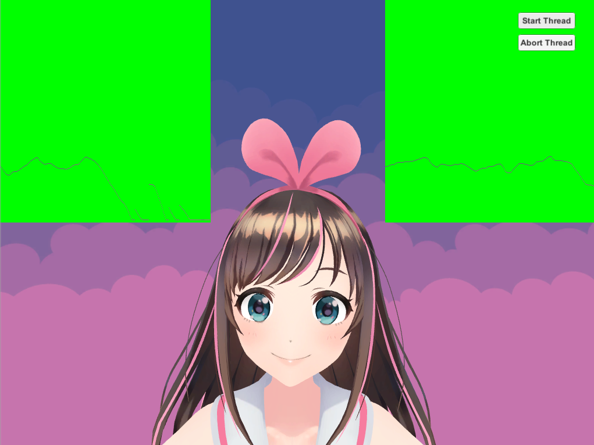
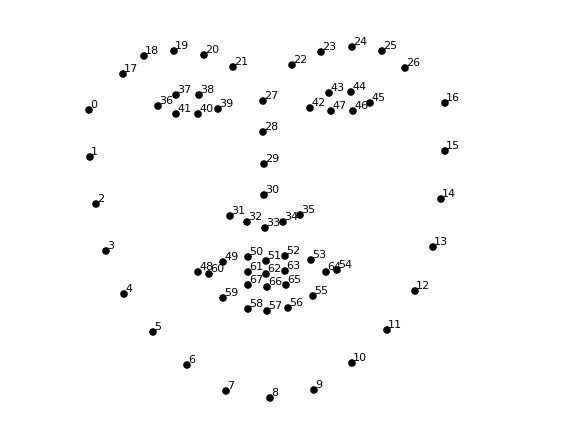
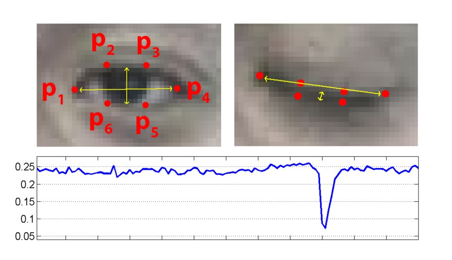
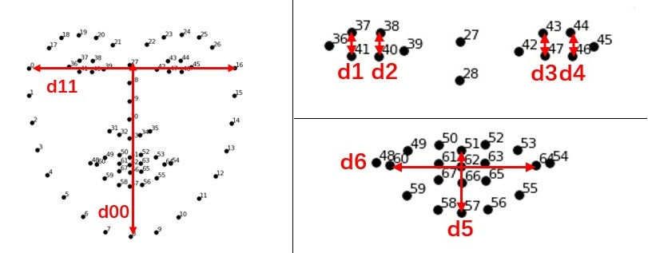
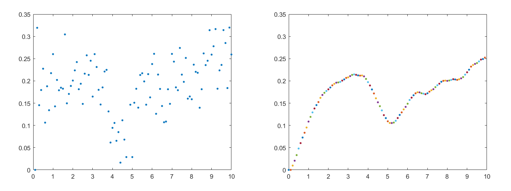
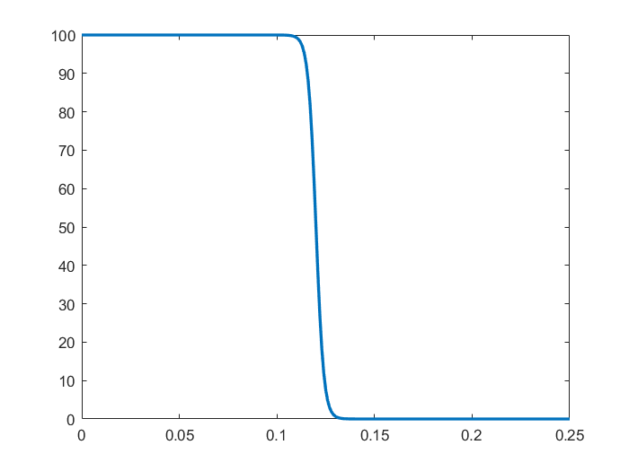
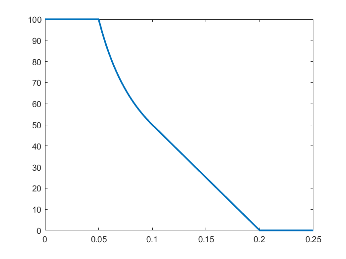

# OpenVHead

**Author:** [Tianxing Wu](https://github.com/TianxingWu)

<p align="center">
    
</p>

## 1. Introduction

This is an on-going project to build a vision-based head motion capture system for **VTubers**. To make the animation looks more authentic, several filters and control methods are used to smooth and enhance the robustness of the head motion and facial expressions. The system is mainly built with C# and Python in Unity3D environment.

Let's try it on your own! Feel free to add new functions to the project or just play around with it and have fun. Please star :star: this project if you like it! :blush:

The technical details are described in section [4](#4.-Method), which gives you an overview of how this system works. It's OK to skip this part if you are not interest in them.

To cite this repo, please reference the name "OpenVHead" with the project link [here](https://github.com/TianxingWu/OpenVHead).

## 2. Prerequisite

### 2.1 Hardware
- PC
- RGB camera (compatible with both built-in webcam and external USB camera)

### 2.2 Software
#### 2.2.1 Environment
- Windows system
- Python 3.6.x
- Unity 2018.4.x
#### 2.2.2 Package dependencies
- opencv-python (tested with version 3.4.0)
- dlib (tested with version 19.7.0)


## 3. Usage
### 3.1 Quit Start
1. Configure the environment. You may use pip to install the required packages. The .whl file of opencv-python 3.4.0 and dlib 19.7.0 packages can be downloaded from [here](https://pypi.org/project/opencv-python/3.4.0.12/#files) and [here](https://pypi.org/project/dlib/19.7.0/#files). Note that you should choose the appropriate version.

2. Clone the repository to your workspace. You can also download the .zip file of the [latest release](https://github.com/TianxingWu/OpenVHead/releases/latest) or older versions from [Release](https://github.com/TianxingWu/OpenVHead/releases).

3. Open the folder as a project in Unity.

4. Drag "MainScene" from Assets -> scenes to the Hierarchy and remove the "Untitled" scene.

5. Press the Play button to run the project.

6. Press the "Start Thread" button on the UI to start the C# socket server. An output window should pop up and the Python client would start to communicate with the sever. Now the Python script would be running in the background to extract features from the video stream captured by camera and send them to Unity. The virtual character comes to life!

7. Press the Play button again to stop the program. It's not recommended to press the "Stop Thread" button since it seems to cause bugs from time to time. 

### 3.2 Model Selection
This system now has two character models with customized parameter settings. To change the character model, select the corresponding GameObject in the Scene hierarchy and unhide it by clicking on the toggle next to the object's name in the inspector, while the other GameObject should be hide. For example, if you want to change from model 1 to model 2, the settings should look like this:

<p align="center">
    
</p>

### 3.3 Add new model
You can add new character to the system if you have your own 3D model which has blend shapes (can be set up in 3D modeling application, such as Autodesk® Maya®). The model should be export to an FBX file first.

Once the FBX file is ready, you should do the following steps to get it to work:

1. Import your FBX file in Unity.

2. Drag the imported model to the main scene. If the model is imported as a prefab asset, right click on the asset in Hierarchy and select "Unpack Prefab".

3. Copy and paste the "ParameterServer (Model 2)" and "HeadController (Model 2)" GameObject from the "KizunaAI (Model 2)" GameObject's hierarchy to your model GameObject.

4. Click "Add Component" in the mesh GameObject's Inspector and add the script object: "Blend Shapes Controller" which should shown in the drop-down list.

5. Change the values in "Blend Shapes Controller" according to the number of the blend shapes that you want to control. Note that the blend shapes are numbered from 0.

6. Unhide your model and hide other models as is instructed in [3.2](#3.2-Model-Selection). Enjoy!

### 3.4 Debug mode
To make it easier to tune the control parameters, a debug mode is offered to visualize some of them. You can enable this mode by unhiding the child GameObjects of Canvas: RightData and LeftData. You would then see the real time plotting as follows:

<p align="center">
    
</p>

The displayed data is set as the eyes' openness value for the Kizuna AI model by default. You can change the data by modify the "Data Select" number in the Inspector window of each aforementioned GameObject.

If you want to monitor the output of the Python Script, comment the following line in [SocketServer.cs](\Assets\Scripts\SocketServer.cs)

```
WindowStyle = System.Diagnostics.ProcessWindowStyle.Hidden
```

## 4. Method
The system can be divided into two parts: Front-end (Python part) and Back-end (Unity part).

### 4.1 Front-end (Python)
#### 4.1.1 Face landmarks tracking
To estimate the head position, orientation and the facial expressions features, 68 face landmarks are got first using **Dlib** and OpenCV.

<p align="center">
    
</p>

Since the location of the detected landmarks are quite noisy which would make pose estimation extremely unstable, a **Kalman filter** is used to track the landmarks, which means the history information is used rather than  just relying on the detected location from current frame alone.

Specifically, two Kalman filters are applied to the x-coordinate and y-coordinate of the 68 points, respectively.

To make the tracking result even more smooth, the state vector of the Kalman filter is then sent to a **mean filter** which has a window size of 5 (frames).

Note: The landmarks used for [4.1.3](4.1.3-Facial-expression-features-extraction) are the original detected ones without filtering, since the filter would bring too much delay and ruin the sensitivity of facial expression measures. A control method is taken at the back-end instead to increase robustness without too much cost of delay. (See [4.2.2](#4.2.2-Facial-expression-control))

#### 4.1.2 Pose estimation
The position and orientation of an object in 3D scene can be estimated using a monocular camera through **PnP (Perspective-n-Point)** measurement. Rather than write a piece of my own, I decided to use the built-in function offered by OpenCV since it has different algorithms to choose. For this part of implementation, I refer to Satya Mallick's blog [Head Pose Estimation using OpenCV and Dlib](https://www.learnopencv.com/head-pose-estimation-using-opencv-and-dlib/) and you can find more theoretical details there.

However, please note that I have modified some part of the implementation to be compatible with my specific application, which includes:

- Rather than using the 5 **feature points** mentioned in the blog, I choose another set of points since they are more stable than the original ones when the facial expressions become exaggerated
- The rotation vector is converted to **quaternions** to adapt to the Unity applications
- The algorithm to solve PnP is set to **DLS** rather than the default one

#### 4.1.3 Facial expression features extraction
Several studies has been done to extract facial expression features from face landmarks. One of the mostly used feature for eye-blinking detection is called Eye-Aspect-Ratio [[1](#8.-References)] as shown below:

<p align="center">
    
</p>

<p align="center"></p>


This measure is quite simple and straight forward. However, it does not have good **rotational invariance**, since the denominator would change a lot undesirably when the head shakes from one side to another. Thus, after a series of tests I construct a more robust measure for the eyes' openness, and also construct similar measures to describe the shape of the mouth.
<p align="center">
    
</p>

<p align="center"></p>


The core idea is to define a reference distance which is insensitive to the rotation.

### 4.2 Back-end (Unity C#)
After the position, rotation and feature vectors are got at the Python front-end, they are then transferred to the C# back-end through socket, which is described in [4.3](#4.3-Socket-communication). With this collection of information, several steps are taken here to actually make the virtual character move up properly. The implementation details are slightly different between the two models. Most of time I will only take the model 2 as the example because it has more generality.

#### 4.2.1 Pose control
In fact, theoretically you can directly apply the estimated position vector and rotation quaternions to the model if you use something like model 1 (pure head). However, since I haven't implemented inverse kinematics to the more generalized model like model 2, for these models the position is fixed, which means you can only control the rotation of it. 

Furthermore, since the setting of world coordinate system are different in OpenCV and in Unity, a new, fixed **rotation transformation** is applied to the quaternions. I'll just leave the formula of the quaternion multiplication alone for simplification.

Before the computed quaternions are applied to the model, the four parameters are sent to a **Kalman filter** again to ensure the smooth motion.


#### 4.2.2 Facial expression control
##### 4.2.2.1. Dealing with noise
As is mentioned in [4.1.1](#4.1.1-Face-landmarks-tracking), the landmarks used for facial expressions are un-filtered due to some considerations, as a result the measures we got here (, , , etc.) are quite noisy. To solve this problem, I think up an interesting method that turn it into a **control problem**.

Specifically, I take the **input measure** as the **desired position** of a **mass**, and an **input force** given by **incomplete derivative PD control** is attached to the mass. Then the **actual position** of the mass is used as the **output measure**.

Speaking from another perspective, what I've done is actually constructing a **second-order mass-spring-damper system** with a low pass filter to model this process.

One of the test results is shown in the figure below. On the left is the original signal and on the right is the processed signal.

<p align="center">
    
</p>

The method can be divided into two steps.

**Step 1. Model a dynamic system with Newton's law**
```
a = F/M;     // Update acceleration
v = v + a*T; // Update velocity
x = x + v*T; // Update position
```

Where **T** is the time interval, which is set to 0.1 (s), and the mass **M** is set to around 1-5 (kg). Note that these two parameters should be compatible with each other.

**Step 2. Apply incomplete derivative PD control**

After the input measure is passed to **x_d**, run the following lines:
```
e = x_d - x;      // Update error
de = (e - e_1)/T; // Compute the derivative of error
p_out = KP*e;     // Proportional term
d_out = (1-ALPHA)*KD*de + ALPHA*d_out_1; //Derivative term

e_1 = e;          // Update last error
d_out_1 = d_out;  // Update last derivative term
```

Where **KP**, **KD** are parameters for the PD controller and **ALPHA** is the incomplete derivative coefficient. The response characteristic of the controller can be altered by tuning these parameters. To ensure robustness, the following relation is always kept to make sure that the system is **overdamped**:

<p align="center"></p>

Here are two frequency response diagrams of the system with ALPHA = 0 and ALPHA = 0.7, respectively. They can reflect how much the high-frequency noise would affect the output.

<p align="center">
    
</p>

More details of the implementation can be refered to [ParameterServer.cs](\Assets\Scripts\ParameterServer.cs).

##### 4.2.2.2 Blend shape functions
To make the facial expression of the virtual character more realistic, I write customized deformation functions for the blend shapes of model 2: **Blinking function**, **Shocked function** and **Mouth deformation function**. Since the function may vary according to the specific model, I'll just list the most representative and important one here, which is the eyes' **Blinking function**. It has two versions at present.

| Version 1: A parameterized sigmoid function | Version 2: A piecewise function |
| --- | --- |
|  |  |
| <p align="center"></p> | <p align="center"></p> |

Where  is the processed measurement;  is the weight applied to the blend shape controller, ranging from 0 (no deformation) to 100 (max deformation).

##### 4.2.2.3 A little trick:
When tuning the parameters, there is always a contradiction between  robustness and sensitivity. Especially when controlling the shape of the eye, it is reasonable to keep it smooth, which requires a longer response time, but that would also make the detection of blinking more challenging. To solve this problem, I use a small trick here. 

- **In the dynamic system part:** While keep the system as smooth as you can, **force** the "position", that is, the measure, **to be zero** when the original measure is lower than a pre-set threshold.
- **In the blend shape part:** Use the same threshold as the upper bound for 100 weight (eye fully closed).

The following figure demonstrates the difference of the system response without and with this trick. ,  and  are the eye-closed duration of the original response, while  is eye-closed duration of the new response.

<p align="center">
    
</p>


### 4.3 Socket communication
The communication between the front-end and the back-end is made possible using **Socket**. Specifically, a **Unity C# server** and a **Python client** are setup to transfer data through a TCP/IP connection. The details of this part of implementation can be refered to [SocketServer.cs](\Assets\Scripts\SocketServer.cs).

The socket endpoint is set at:

- IP address: 127.0.0.1
- Port: 1755


## 5. Known Issues
- Sometimes the Python script running in the background could fail to terminate after releasing the Play button. If this happens, navigate to the "Output" window (the one that contains your face) and press 'ESC', and the thread would be stopped manually. 
- The performance may depend on the hardware you use. This program runs perfectly on my current laptop with i7-9750H CPU and RTX 2060 GPU, but it runs quite slow when tested on my old laptop with i7-6500U CPU and AMD Radeon R7 M360 GPU (bought in 2016). I'm not sure about the minimum system requirements at present. Please create a issue with your hardware condition if you encounter similar problems. 

## 6. Acknowledgement
The overall structure of the head pose estimation part is adapted from [Head Pose Estimation using OpenCV and Dlib](https://www.learnopencv.com/head-pose-estimation-using-opencv-and-dlib/) by Satya Mallick and [this blog](https://blog.csdn.net/yuanlulu/article/details/82763170) by yuanlulu.

The model file 'shape_predictor_68_face_landmarks.dat' for face landmarks detection was created by [Davis King](https://github.com/davisking) for part of the dlib example programs, and was trained on the iBUG 300-W face landmark dataset. Note that the license for the iBUG 300-W dataset excludes commercial use. So you should contact Imperial College London to find out if it's OK for you to use this model file in a commercial product.

The Kizuna AI 3D model (Model 2) is converted from the PMX model offered by Tomitake on Kizuna AI's [official website](https://kizunaai.com/) &copy;KizunaAI . It is only used as a demo for research in this project. Further information about the term of use of this model should be referred to the original site [here](https://kizunaai.com/download/).

I would also like to thank my friend [@Arsennnic](https://github.com/Arsennnic) for his support and precious advices.

## 7. What's Next
- [x] New blinking function
- [ ] Gaze tracking
- [ ] Facial expression classification
- [ ] Physical engine for other components: hair, headwear(piukupiuku), etc.

## 8. References
- [1] Tereza Soukupova´ and Jan Cˇ ech. Real-Time Eye Blink Detection using Facial Landmarks. 21st Computer Vision Winter Workshop, February 2016.
