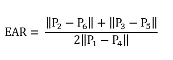
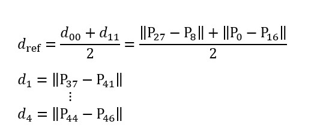
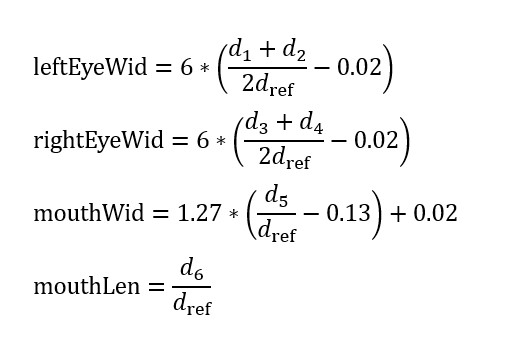

# OpenVHead

**Author:** [Tianxing Wu](https://github.com/TianxingWu)

<p align="center">
    
</p>

## 1. Introduction

This is an on-going project to build a virtual head system for **VTubers**. To make the animation looks more authentic, several filters and control methods are used to smooth and enhance the robustness of the head motion and facial expressions. The system is mainly built with C# and Python in Unity3D environment.

Let's try it on your own! Please feel free to add new functions to this project or just play around with it for entertainment. 

To cite this repo, please reference the name "OpenVHead" with the project link [here](https://github.com/TianxingWu/OpenVHead).

The detailed documentation for the method is still under construction.

## 2. Prerequisite

### 2.1 Hardware
- PC
- RGB camera (compatible with both built-in webcam and external USB camera)

### 2.2 Software
#### 2.2.1 Environment
- Windows system
- Python 3.6.x
- Unity 2018.4.x
#### 2.2.2 Package dependencies
- opencv-python (tested with version 3.4.0)
- dlib (tested with version 19.7.0)


## 3. Usage
### 3.1 Quit Start
1. Configure the environment. You may use pip to install the required packages. The .whl file of opencv-python 3.4.0 and dlib 19.7.0 packages can be downloaded from [here](https://pypi.org/project/opencv-python/3.4.0.12/#files) and [here](https://pypi.org/project/dlib/19.7.0/#files). Note that you should choose the appropriate version.

2. Clone or download the repository to your workspace.

3. Open the folder as a project in Unity.

4. Press the Play button to run the project.

5. Press the "Start Thread" button on the UI to start the C# socket server. An output window should pop up and the Python client would start to communicate with the sever. Now the Python script would be running in the background to extract features from the video stream captured by camera and send them to Unity. The virtual character comes to life!

6. Press the Play button again to stop the program. It's not recommended to press the "Stop Thread" button since it seems to cause bugs from time to time. 

### 3.2 Model Selection
This system now has two character models with customized parameter settings. To change the character model, select the corresponding GameObject in the Scene hierarchy and unhide it by clicking on the toggle next to the object's name in the inspector, while the other GameObject should be hide. For example, if you want to change from model 1 to model 2, the settings should look like this:

<p align="center">
    
</p>

### 3.3 Add new model
You can add new character to the system if you have your own 3D model which has blend shapes (can be set up in 3D modeling application, such as Autodesk® Maya®). The model should be export to an FBX file first.

Once the FBX file is ready, you should do the following steps to get it to work:

1. Import your FBX file in Unity.

2. Drag the imported model to the main scene. If the model is imported as a prefab asset, right click on the asset in Hierarchy and select "Unpack Prefab".

3. Copy and paste the "ParameterServer (Model 2)" and "HeadController (Model 2)" GameObject from the "KizunaAI (Model 2)" GameObject's hierarchy to your model GameObject.

4. Click "Add Component" in the mesh GameObject's Inspector and add the script object: "Blend Shapes Controller" which should shown in the drop-down list.

5. Change the values in "Blend Shapes Controller" according to the number of the blend shapes that you want to control. Note that the blend shapes are numbered from 0.

6. Unhide your model and hide other models as is instructed in section 3.2. Enjoy!

### 3.4 Debug mode
To make it easier to tune the control parameters, a debug mode is offered to visualize some of them. You can enable this mode by unhiding the child GameObjects of Canvas: RightData and LeftData. You would then see the real time plotting as follows:

<p align="center">
    
</p>

The displayed data is set as the eyes' openness value for the Kizuna AI model by default. You can change the data by modify the "Data Select" number in the Inspector window of each aforementioned GameObject.

If you want to monitor the output of the Python Script, comment the following line in [SocketServer.cs](\Assets\Scripts\SocketServer.cs)

```
WindowStyle = System.Diagnostics.ProcessWindowStyle.Hidden
```

## 4. Methods Overview
The system can be devided into two parts: Front-end (Python part) and Back-end (Unity part).

### 4.1 Front-end (Python)
#### 4.1.1 Face landmarks tracking
To estimate the head position, orientation and the facial expressions features, 68 face landmarks are got first using **Dlib** and OpenCV.

<p align="center">
    
</p>

Since the location of the detected landmarks are quite noisy which would make pose estimation extremly unstable, a **kalman filter** is used to track the landmarks, which means the history information is used rather than  just relying on the detected location from current frame alone.

Specifically, two kalman filters are applied to the x-coordinate and y-coordinate of the 68 points, respectively.

To make the tracking result even more smooth, the state vector of the kalman filter is then sent to a **mean filter** which has a window size of 5 (frames).

#### 4.1.2 Pose estimation
The position and orientation of an object in 3D scene can be estimated using a monocular camera through **PnP (Perspective-n-Point)** measurement. Rather than write a piece of my own, I decided to use the built-in function offered by OpenCV since it has different algorithms to choose. For this part of implemention, I refer to Satya Mallick's blog [Head Pose Estimation using OpenCV and Dlib](https://www.learnopencv.com/head-pose-estimation-using-opencv-and-dlib/) and you can find more theoretical details there.

However, please note that I modified some part of the implemention to be compatible with my specific application, which includes:

- Rather than using the 5 **feature points** mentioned in the blog, I choose another set of points since they are more stable than the original ones when the facial expressions become exaggerated

- The rotation vector is converted to **quaternions** to adapt to the Unity applications

- The algorithm to solve PnP is set to **DLS** rather than the default one

#### 4.1.3 Facial expression features extraction
Several studies has been done to extract facial expression features from face landmarks. One of the mostly used feature for eye-blinking detection is called Eye-Aspect-Ratio [[1](#8.-References)] as shown below:

<p align="center">
    
</p>
<p align="center">
    
</p>

This measure is quite simple and straight forward. However, it does not have good rotational invariance, since the denominator would change a lot undesirably when the head shakes from one side to another. Thus, after a series of tests I construct a more robust measure for the eyes' openness, and also construct similar measures to describe the shape of the mouth.
<p align="center">
    
</p>
<p align="center">
    
</p>
<p align="center">
    
</p>

The core idea is to define a reference distance which is insensitive to the rotation.

### 4.2 Back-end (Unity C#)
#### 4.2.1 Pose control
#### 4.2.2 Facial expression control
##### 1. Construct dynamic system
##### 2. Incomplete derivative PD control
##### 3. Blinking function

### 4.3 Socket communication


## 5. Known Issues
Sometimes the Python script running in the background could fail to terminate after releasing the Play button. If this happens, navigate to the "Output" window (the one that contains your face) and press 'ESC', and the thread would be stopped manually. 

## 6. Acknowledgement
The overall structure of the head pose estimation part is adapted from [Head Pose Estimation using OpenCV and Dlib](https://www.learnopencv.com/head-pose-estimation-using-opencv-and-dlib/) by Satya Mallick and [this blog](https://blog.csdn.net/yuanlulu/article/details/82763170) by yuanlulu.

The model file 'shape_predictor_68_face_landmarks.dat' for face landmarks detection was created by [Davis King](https://github.com/davisking) for part of the dlib example programs, and was trained on the iBUG 300-W face landmark dataset. Note that the license for the iBUG 300-W dataset excludes commercial use. So you should contact Imperial College London to find out if it's OK for you to use this model file in a commercial product.

The Kizuna AI 3D model (Model 2) is converted from the PMX model offered by Tomitake on Kizuna AI's [official website](https://kizunaai.com/) &copy;KizunaAI . It is only used as a demo for research in this project. Further information about the term of use of this model should be referred to the original site [here](https://kizunaai.com/download/).

## 7. What's Next
- [x] New blinking function
- [ ] Gaze tracking
- [ ] Facial expression classification
- [ ] Physical engine for other components: hair, headwear(piukupiuku), etc.

## 8. References
- [1] Tereza Soukupova´ and Jan Cˇ ech. Real-Time Eye Blink Detection using Facial Landmarks. 21st Computer Vision Winter Workshop, February 2016.